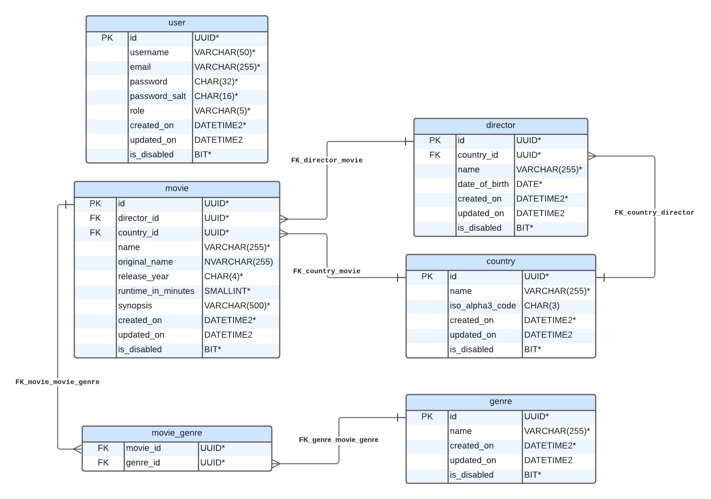

# Database

## Instructions

To create the database, simply run the script [database-creation.sql](DDL/database-creation.sql), located in the *DDL* folder, in a [SQL Server](https://www.microsoft.com/pt-br/sql-server/sql-server-downloads) instance. This script contains the definition of all tables, their indexes and relationships that make up the schema of this project, structured in the correct order.

If your OS does not support SQL Server, you can run the DBMS in a Linux container with Docker. [Learn more](https://learn.microsoft.com/en-us/sql/linux/quickstart-install-connect-docker?view=sql-server-ver16).

After creation, to populate the database, run the seed scripts located in the *DML* folder in the following order:

1. [users-seed.sql](DML/users-seed.sql)
2. [countries-seed.sql](DML/countries-seed.sql)
3. [directors-seed.sql](DML/directors-seed.sql)
4. [movies-seed.sql](DML/movies-seed.sql)
5. [genres-seed.sql](DML/genres-seed.sql)
6. [movie-genre-seed.sql](DML/movie-genre-seed.sql)

It is important to follow the order provided to avoid errors and ensure that the data will be inserted correctly, respecting the table relationships.

PS: *The DML scripts have been broken into several files to avoid centralizing all the commands in a single gigantic SQL file, improving organization and facilitating readability.*

## Entity Relationship Diagram

  

